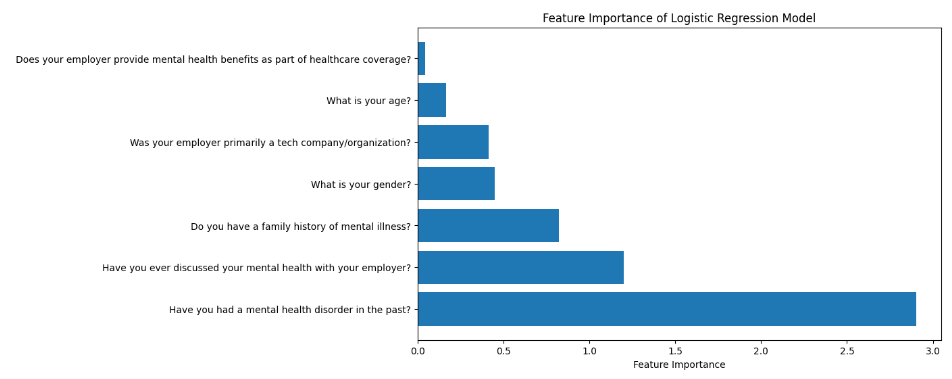

# Predicting Mental Health Disorders Using Machine Learning

## Primary Source/Article
**Title:** Predicting Mental Health Disorders Using Machine Learning for Employees in Technical and Non-Technical Companies  
**Authors:** Rahul Katarya, Saurav Maan  
**Year:** 2020  
**Link to Article:** [IEEE Xplore](https://ieeexplore.ieee.org/document/9368923)

## Project Data: 
The dataset used for this project is the Mental Illness (OSMI) 2019 Survey dataset, which includes data on employee mental health status, their work environments, and other relevant features. you can find here: https://www.kaggle.com/osmihelp/datasets
## Project Documentation:
### Project Overview
This project aims to replicate the findings of the 2020 IEEE paper "Predicting Mental Health Disorders Using Machine Learning for Employees in Technical and Non-Technical Companies" by Rahul Katarya and Saurav Maan. The original paper explored the use of machine learning algorithms to predict mental health disorders among employees in both technical and non-technical companies. It used the (OSMI) Survey dataset to train and evaluate six machine learning models.
The primary objectives of this replication project are to:
- Validate the results presented in the paper.
- Gain insights into the practical implementation of machine learning for predicting mental health disorders in the workplace.
- Examine the performance of different machine learning models on the OSMI dataset.
Additionally, a feature importance analysis is conducted to identify which factors are most predictive of mental health disorders in the workplace.
### Folder/Module Structure
- **`data/`**: Contains datasets for the project.
  - `raw_OSMI_data.csv`: Original dataset.
  - `filtered_data.csv`: Data with selected features.
  - `processed_data.csv`: Cleaned data ready for training.

- **`notebooks/`**: Jupyter notebooks for analysis and visualization.
  - `data_analysis.ipynb`: Data exploration and visualization.
  - `model_comparison.ipynb`: Model performance comparison.
  - `feature_importance.ipynb`: Feature importance analysis.
  - `evaluation.ipynb`: Confusion matrix evaluation.

- **`src/`**: Core scripts for processing, training, and utilities.
  - `train.py`: Model training script.
  - `models.py`: Defines and loads machine learning models.
  - `main.py`: Main entry point to initiate the pipeline.
  - `utils.py`: Helper functions for data handling.
  - `preprocess.py`: Data cleaning and preprocessing functions.
  - `logger.py`: Logging script for tracking progress.
- **`test/`**: Unit tests for major functions.
  - `test_functions.py`: Tests for data loading, preprocessing, and evaluation.
### Project Workflow/Pipeline: 
The project follows these steps:
1. Data Preprocessing:
   - Clean and transform raw data.
   - Handle missing values, categorical variables, and normalize age data.
2. Model Evaluation:
   - Evaluate multiple machine learning models using K-fold cross-validation.
   - Measure performance using precision, recall, accuracy, and F1-score.
3. Feature Importance Analysis:
   - Identify the most important features contributing to mental health disorders.
   
4. Model Selection:
   - Train and evaluate seven models(The six models in the paper and one additional) including KNN, SVM, Random Forest,Decision tree, Naivebayes and XGBoost.
   
For detailed  documentation, refer to the full project documentation in (Results/Documnetation.pdf)

## To Run the Project:

Follow the steps below to set up your environment and run the project.
### 1. Install Virtualenv 
Install `virtualenv` globally using pip:
```bash
pip install virtualenv
# Create a virtual environment (specific to this project)
python -m venv venv

# Activate the virtual environment
.\venv\Scripts\activate
# Once activated, (venv) should appear as a prefix in your terminal
# Upgrade pip to the latest version
python -m pip install --upgrade pip

# Install project dependencies 
pip install -e .

# Install development dependencies 
pip install -e .[dev]
